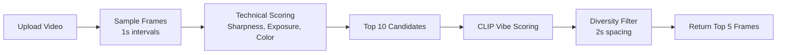

<<<<<<< HEAD
# VibeFrame 🎬✨

AI-powered video frame extraction that captures the perfect moment matching your vibe.


## 🌟 Features

- **AI-Powered Frame Selection**: Uses CLIP and YOLO models to intelligently select the best frames
- **Vibe Matching**: Describe your desired aesthetic and get frames that match your intent
- **Technical Quality Scoring**: Analyzes sharpness, exposure, and color vibrancy
- **Composition Analysis**: Detects subjects, depth of field, and visual balance
- **Beautiful UI**: Modern glassmorphism design with smooth animations
- **Fast Processing**: Optimized pipeline processes 30s videos in ~30-40 seconds

## 📁 Project Structure

```
vibe_frame/
├── backend/                 # FastAPI backend server
│   ├── core/               # Core ML logic
│   │   ├── __init__.py
│   │   ├── video_processor.py  # Video frame extraction
│   │   └── scorer.py           # AI scoring (CLIP, YOLO, quality metrics)
│   ├── main.py             # FastAPI application
│   ├── requirements.txt    # Python dependencies
│   ├── uploads/            # Temporary video uploads (gitignored)
│   └── static/             # Extracted frames (gitignored)
│
├── frontend/               # React + Vite frontend
│   ├── src/
│   │   ├── components/     # React components
│   │   │   ├── LandingPage.tsx
│   │   │   ├── VideoUploader.tsx
│   │   │   ├── VibeSelector.tsx
│   │   │   ├── Gallery.tsx
│   │   │   └── SmartPlayer.tsx
│   │   ├── App.tsx         # Main app component
│   │   ├── index.css       # Tailwind styles
│   │   └── main.tsx        # Entry point
│   ├── package.json        # Node dependencies
│   └── vite.config.ts      # Vite configuration
│
├── run_project.ps1         # PowerShell script to start both servers
└── README.md               # This file
```

## 🚀 Quick Start

### Prerequisites

- **Python 3.8+**
- **Node.js 16+**
- **Git**

### Installation

1. **Clone the repository**
   ```bash
   git clone https://github.com/yourusername/vibeframe.git
   cd vibeframe
   ```

2. **Backend Setup**
   ```bash
   cd backend
   python -m venv venv
   
   # Windows
   .\venv\Scripts\activate
   
   # Linux/Mac
   source venv/bin/activate
   
   pip install -r requirements.txt
   ```

3. **Frontend Setup**
   ```bash
   cd ../frontend
   npm install
   ```

### Running the Application

#### Option 1: Using PowerShell Script (Windows)
```powershell
.\run_project.ps1
```

#### Option 2: Manual Start

**Terminal 1 - Backend:**
```bash
cd backend
uvicorn main:app --reload --host 0.0.0.0 --port 8000
```

**Terminal 2 - Frontend:**
```bash
cd frontend
npm run dev
```

Then open [http://localhost:5173](http://localhost:5173) in your browser.

## 🎯 How It Works

### 1. Video Processing Pipeline



### 2. Scoring System

- **Technical Score (50%)**: Sharpness, exposure, color vibrancy
- **Composition Score (20%)**: Subject detection, visual balance
- **Vibe Score (50%)**: CLIP-based semantic matching with user prompt

### 3. Optimization Strategy

- **Two-Pass Processing**: Quick technical scoring first, then expensive CLIP on top candidates
- **Adaptive Sampling**: 1-second intervals for speed
- **Selective CLIP**: Only top 10 candidates processed with AI
- **Diversity Filter**: Ensures frames are spread across the video (min 2s apart)

## 🛠️ Tech Stack

### Backend
- **FastAPI**: Modern Python web framework
- **OpenCV**: Video processing and computer vision
- **CLIP**: OpenAI's vision-language model for vibe matching
- **YOLO v8**: Object detection for composition analysis
- **PyTorch**: Deep learning framework

### Frontend
- **React 18**: UI framework
- **TypeScript**: Type-safe JavaScript
- **Tailwind CSS v3**: Utility-first CSS
- **Vite**: Fast build tool
- **Axios**: HTTP client
- **Lucide React**: Beautiful icons

## 📊 Performance

- **30s video**: ~30-40 seconds processing time
- **Sampling**: 1 frame per second
- **CLIP operations**: Limited to top 10 candidates
- **Output**: 5 diverse, high-quality frames

## 🎨 Design Philosophy

- **Cyber/Midnight Theme**: Dark mode with purple/pink gradients
- **Glassmorphism**: Frosted glass effects with backdrop blur
- **Smooth Animations**: Micro-interactions for premium feel
- **Responsive**: Works on desktop and mobile

## 🔧 Configuration

### Backend Settings
Edit `backend/main.py`:
- `sample_interval`: Frame sampling rate (default: 1.0s)
- `UPLOAD_DIR`: Video upload directory
- `STATIC_DIR`: Extracted frames directory

### Frontend Settings
Edit `frontend/src/App.tsx`:
- Backend API URL (default: `http://localhost:8000`)

## 📝 API Documentation

### POST `/analyze`

Upload a video and get AI-selected frames.

**Request:**
- `file`: Video file (MP4, MOV, WEBM, max 100MB)
- `vibe_text`: Optional text description of desired vibe
- `sample_interval`: Optional sampling interval (default: 1.0s)

**Response:**
```json
{
  "video_id": "uuid",
  "total_frames_processed": 30,
  "best_frames": [
    {
      "timestamp": 5.0,
      "url": "/static/uuid/frame_5000.jpg",
      "scores": {
        "total": 0.85,
        "technical": 0.78,
        "composition": 0.82,
        "vibe": 0.91
      }
    }
  ]
}
```

## 🤝 Contributing

Contributions are welcome! Please feel free to submit a Pull Request.

## 📄 License

This project is licensed under the MIT License - see the [LICENSE](LICENSE) file for details.

## 🙏 Acknowledgments

- [OpenAI CLIP](https://github.com/openai/CLIP) for vision-language understanding
- [Ultralytics YOLO](https://github.com/ultralytics/ultralytics) for object detection
- [FastAPI](https://fastapi.tiangolo.com/) for the amazing web framework
- [Tailwind CSS](https://tailwindcss.com/) for beautiful styling

## 📧 Contact

For questions or feedback, please open an issue on GitHub.

---

Made with ❤️ and AI
=======
# Snowstorm
>>>>>>> 9ee0c84bfb2478e445fa3884a54b9fa8113450f8
